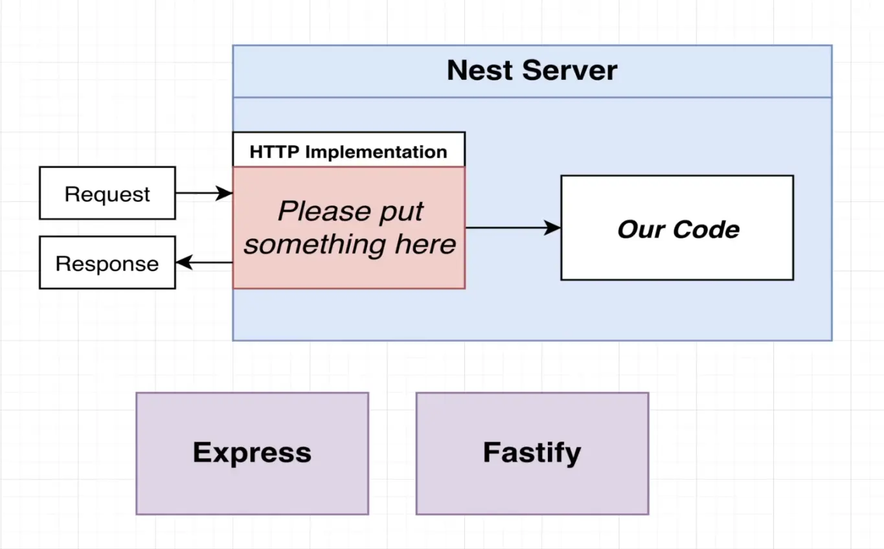
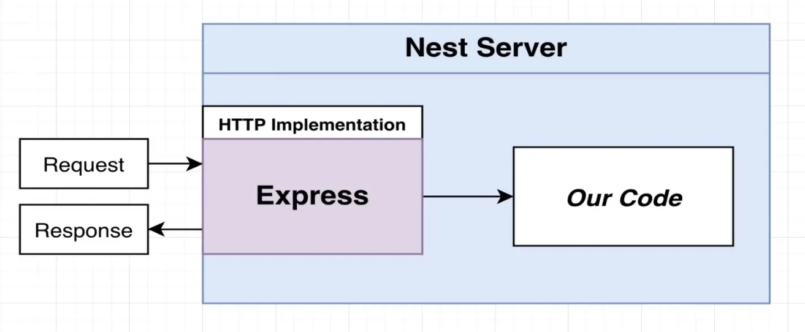
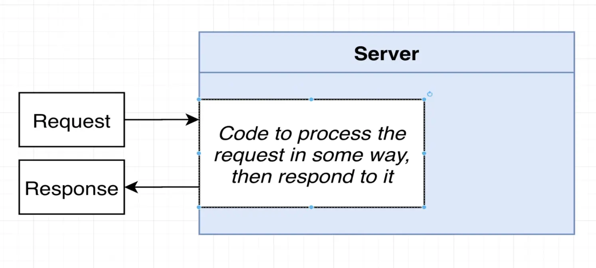
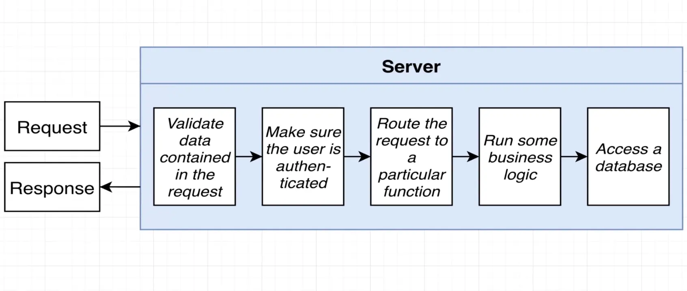
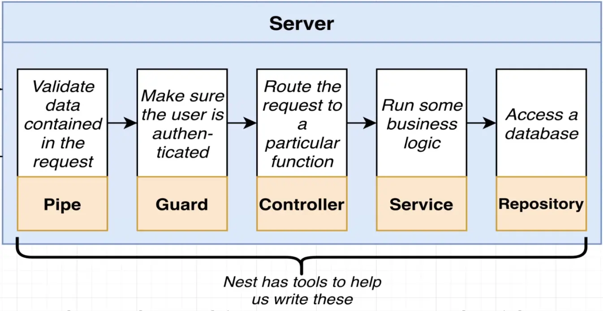

# nestjs-scratch-24

Dependencies Explained

@nestjs/common
Contains vast majority of functions, classes, etc, that we need from Nest

@nestjs/core

@nestjs/platform-express
Lets Nest use Express JS for handling HTTP requests

reflect-metadata
Helps make decorators work. Tons more on this in just a minute!

typescript
We write Nest apps with Typescript.

Nest itself does not handle incoming request, instead it relies upon outside implementation to handle httpo request for it.

 We have to provide HTTP implentation server to nest to handle incoming request and reply with outgoing response.

 We can either make use of express or fastify. Default is expres when you generate a new Nestjs project.

Let's see how a normal server we build looks like.

Regardless of what framework or language you use to build a server, its main functions would stay the same in most cases.

1. Incoming Requests
2. Validate Data
3. Authenticate User
4. Route the request
5. Business Logic
6. Access Database

In Nestjs we get special set of tools to help us with each of these particular steps.

 

**Controllers** -Handles incoming requests

**Services** - Handles data access and business logic

**Modules** - Groups together code

**Pipes** - Validates incoming data

**Filters** - Handles errors that occur during request handling

**Guards** - Handles authentication

**Interceptors** - Adds extra logic to incoming requests or outgoing responses

**Repositories** - Handles data stored in a DB

 

Every nest project will have at least one controller anbd one module in order to work.